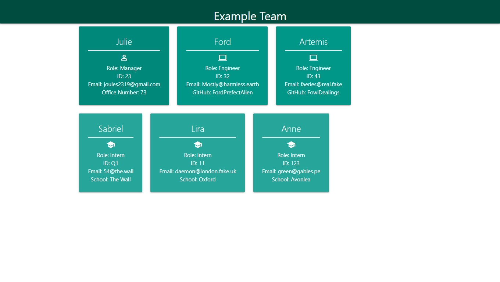
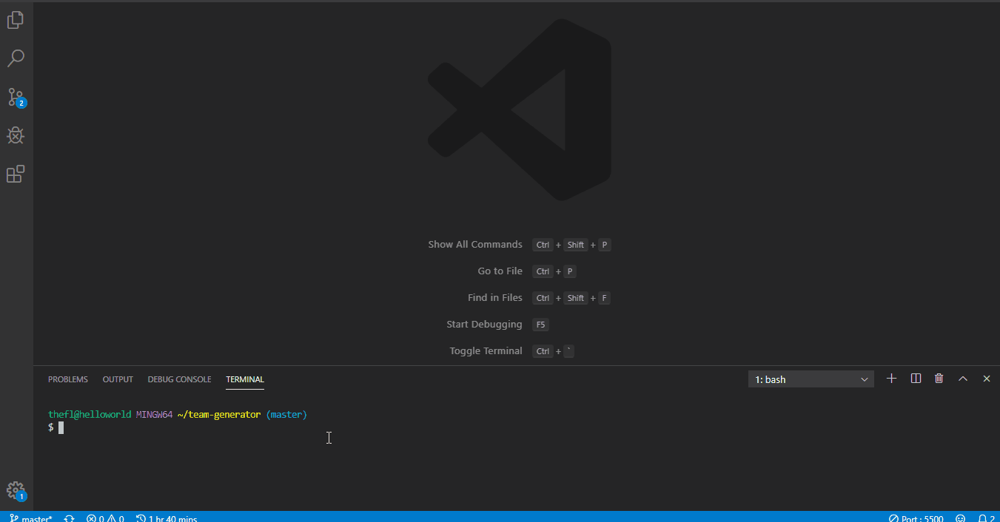

# Team Profile Generator

## What it is

This is a local node application that will take user input to generate a development team and output the team's information into an html page.

## Where it is

The application files can be downloaded to your local machine using:

git clone <https://github.com/JulieT2319/team-generator.git>

## How to use it

Using your cli, cd into the application folder.

npm i

After the required packages have installed, run the program using the command:

node app.js

Answer the prompts provided.

The program will generate the html file to the application's output folder.
